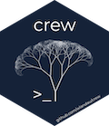

# crew: a distributed worker launcher 

[](https://www.repostatus.org/#WIP)
[](https://github.com/wlandau/crew/actions?query=workflow%3Acheck)
[](https://app.codecov.io/gh/wlandau/crew)
[](https://github.com/wlandau/crew/actions?query=workflow%3Alint)

In computationally demanding analysis workflows, statisticians and data
scientists asynchronously deploy long-running tasks to distributed
systems, ranging from traditional clusters to cloud services. The
[NNG](https://nng.nanomsg.org)-powered
[`mirai`](https://github.com/shikokuchuo/mirai) R package is a powerful
task scheduler that efficiently processes these intense workloads. The
role of the `crew` package is merely to extend
[`mirai`](https://github.com/shikokuchuo/mirai) to computing platforms
beyond local multicore processing. With its unifying interface to
multiple backends, `crew` resembles packages
[`clustermq`](https://mschubert.github.io/clustermq/),
[`future`](https://future.futureverse.org/), and
[`batchtools`](https://mllg.github.io/batchtools/).

## Installation

`crew` is not yet available on CRAN, and it requires the development
version of [`mirai`](https://github.com/shikokuchuo/mirai).

``` r
install.packages("nanonext")
install.packages("mirai", repos = "https://shikokuchuo.r-universe.dev")
remotes::install_github("wlandau/crew")
```

## Documentation

Please see <https://wlandau.github.io/crew/> for documentation,
including a full function reference and usage tutorial vignettes.

## Usage

First, start a `crew` session. The session reserves a TCP port to
monitor the presence and absence of parallel workers. Call
`crew_session_start()` to start the session. Later on, when you are done
using `crew`, call `crew_session_terminate()` to release the port.

``` r
library(crew)
crew_session_start()
```

First, create a controller object. Thanks to the powerful features in
[`mirai`](https://github.com/shikokuchuo/mirai),
`crew_controller_callr()` allows several ways to customize the way
workers are launched and the conditions under which they time out. For
example, arguments `tasks_max` and `seconds_idle` allow for a smooth
continuum between fully persistent workers and fully transient workers.

``` r
controller <- crew_controller_callr(
  workers = 2,
  tasks_max = 3,
  auto_scale = "demand"
)
```

The `start()` method starts a local
[`mirai`](https://github.com/shikokuchuo/mirai) client and dispatcher to
listen to workers that dial in.

``` r
controller$start()
controller$router$sockets
#> [1] "ws://196.168.0.2:55899" "ws://196.168.0.2:55900"
```

Use the `push()` method to submit a task. When you do, `crew`
automatically scales up the number of workers to meet demand, within the
constraints of the `auto_scale` and `workers` arguments of
`crew_controller_callr()`.

``` r
controller$push(
  name = "get worker process ID",
  command = ps::ps_pid()
)
```

You have the option to block the R session until results are available,
but this is not necessary because
[`mirai`](https://github.com/shikokuchuo/mirai) supports a [local active
queue
daemon](https://github.com/shikokuchuo/mirai/blob/main/README.md#connecting-to-remote-servers-through-a-local-server-queue)
which runs in the background and submits tasks to workers as soon as
there is availability.

``` r
controller$wait()
```

When the result is available, you can retrieve it with `pop()`.

``` r
out <- controller$pop()
```

The result is a
[monad](https://en.wikipedia.org/wiki/Monad_(functional_programming))
with the result and its metadata. Even if the command of the task throws
an error, it will still return the same kind of
[monad](https://en.wikipedia.org/wiki/Monad_(functional_programming)).

``` r
out
#> # A tibble: 1 × 7
#>   name                  command      result seconds error traceback warni…¹
#>   <chr>                 <chr>        <list>   <dbl> <chr> <chr>     <chr>
#> 1 get worker process ID ps::ps_pid() <int>        0 NA    NA        NA
#> # … with abbreviated variable name ¹​warnings
```

The return value of the command is available in the `result` column. In
our case, it is the process ID of the parallel worker that ran it, as
reported by `ps::ps_pid()`.

``` r
out$result[[1]] # process ID of the parallel worker reported by the task
#> [1] 69631
```

Since it ran on a parallel worker, it is different from the process ID
of the local R session.

``` r
ps::ps_pid() # local R session process ID
#> [1] 69523
```

Continue the above process of asynchronously submitting and collecting
tasks until your workflow is complete. When you are done, terminate the
controller and the `crew` session to clean up the resources.

``` r
controller$terminate()
crew_session_terminate()
```

## Similar work

- [`mirai`](https://github.com/shikokuchuo/mirai): an R framework for
  asynchronous tasks built on [NNG](https://nng.nanomsg.org). The whole
  point of `crew` is simply to extend
  [`mirai`](https://github.com/shikokuchuo/mirai) to different computing
  platforms for distributed workers.
- [`rrq`](https://mrc-ide.github.io/rrq/): a task queue for R powered by
  [Redis](https://redis.io).
- [`rrqueue`](http://traitecoevo.github.io/rrqueue/): predecessor of
  [`rrq`](https://mrc-ide.github.io/rrq/).
- [`clustermq`](https://mschubert.github.io/clustermq/): sends R
  function calls as jobs to computing clusters.
- [`future`](https://future.futureverse.org/): a unified interface for
  asynchronous evaluation of single tasks and map-reduce calls on a wide
  variety of backend technologies.
- [`batchtools`](https://mllg.github.io/batchtools/): tools for
  computation on batch systems.
- [`targets`](https://docs.ropensci.org/targets/): a Make-like pipeline
  tool for R.
- [`later`](https://r-lib.github.io/later/): delayed evaluation of
  synchronous tasks.
- [`promises`](https://rstudio.github.io/promises/): minimally-invasive
  asynchronous programming for a small number of tasks within Shiny
  apps.
- [`callr`](https://github.com/r-lib/callr): initiates R process from
  other R processes.
- [High-performance computing CRAN task
  view](https://CRAN.R-project.org/view=HighPerformanceComputing).

## Thanks

The `crew` package incorporates insightful ideas from the following
people.

- [Charlie Gao](https://github.com/shikokuchuo) created
  [`mirai`](https://github.com/shikokuchuo/mirai) and
  [`nanonext`](https://github.com/shikokuchuo/nanonext), and he
  graciously accommodated the complicated and demanding feature requests
  that made `crew` possible.
- [Rich FitzJohn](https://github.com/richfitz) and [Robert
  Ashton](https://github.com/r-ash) developed
  [`rrq`](https://mrc-ide.github.io/rrq//).
- [Gábor Csárdi](https://github.com/gaborcsardi/) developed
  [`callr`](https://github.com/r-lib/callr) and wrote an [edifying blog
  post on implementing task
  queues](https://www.tidyverse.org/blog/2019/09/callr-task-q/).
- [Kirill Müller](https://github.com/krlmlr/) created the
  [`workers`](https://github.com/wlandau/workers) prototype, an initial
  effort that led directly to the current implementation of `crew`.
  `crew` would not exist without Kirill’s insights about orchestration
  models for R processes.
- [Henrik Bengtsson](https://github.com/HenrikBengtsson/). Henrik’s
  [`future`](https://github.com/HenrikBengtsson/future/) package
  ecosystem demonstrates the incredible power of a consistent R
  interface on top of a varying collection of high-performance computing
  technologies.
- [Michael Schubert](https://github.com/mschubert/). Michael’s
  [`clustermq`](https://mschubert.github.io/clustermq/) package supports
  efficient high-performance computing on traditional clusters, and it
  demonstrates the value of a central `R6` object to manage an entire
  collection of persistent workers.
- [David Kretch](https://github.com/davidkretch). The
  [`paws`](https://github.com/paws-r/paws) R package is a powerful
  interface to Amazon Web Services, and the documentation clearly
  communicates the capabilities and limitations of AWS to R users.
- [Adam Banker](https://github.com/adambanker), co-authored
  [`paws`](https://github.com/paws-r/paws) with [David
  Kretch](https://github.com/davidkretch).
- [David Neuzerling](https://github.com/mdneuzerling). David’s
  [`lambdr`](https://github.com/mdneuzerling/lambdr/) package
  establishes a helpful pattern to submit and collect AWS Lambda jobs
  from R.
- [Mark Edmondson](https://github.com/MarkEdmondson1234/). Mark
  maintains several R packages to interface with Google Cloud Platform
  such as
  [`googleCloudStorageR`](https://github.com/cloudyr/googleCloudStorageR)
  and
  [`googleCloudRunner`](https://github.com/MarkEdmondson1234/googleCloudRunner),
  and he [started the
  conversation](https://github.com/ropensci/targets/issues/720) around
  helping [`targets`](https://github.com/ropensci/targets) submit jobs
  to Google Cloud Run.

## Code of Conduct

Please note that the `crew` project is released with a [Contributor Code
of
Conduct](https://github.com/wlandau/crew/blob/main/CODE_OF_CONDUCT.md).
By contributing to this project, you agree to abide by its terms.

## Citation

``` r
citation("crew")
```
