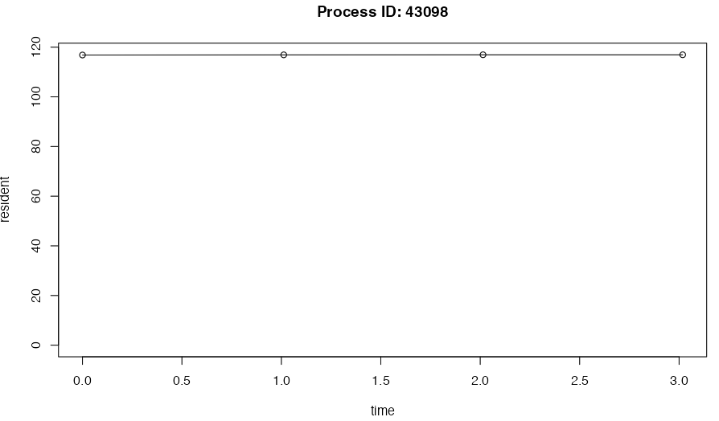

```{r, include = FALSE}
library(crew)
knitr::opts_chunk$set(
  collapse = TRUE,
  comment = "#>"
)
```

`crew` facilitates computationally demanding workloads that consume a lot of memory and CPU resources, and workloads that exhaust these resources may stall or crash. Oftentimes, a crash is silent and there are no clues for troubleshooting. But if you proactively monitor `crew` processes in log files, you can keep track of resource usage and generated prospective data which is useful in diagnosing problems. This vignette describes best practices for logging.

# Processes

`crew` runs in 3 different kinds of R processes:

1. The local R session from which you call `crew_controller_local()` or similar.
2. The `mirai` dispatcher which sends tasks to workers. The dispatcher starts on `controller$start()` and terminates on `controller$terminate()` or when the local R session closes. The dispatcher always runs on the same machine as (1).
3. The workers that accept tasks from (2). These workers may run on different machines, e.g. on a cluster or the cloud, depending on the [launcher plugin](https://wlandau.github.io/crew/articles/plugins.html) you are using.

This vignette first covers logging for local the R session and dispatcher (1 and 2), then logging for workers (3).

# Logging worker processes

Each [launcher plugin](https://wlandau.github.io/crew/articles/plugins.html) has its own way to turn on logging for workers. In the case of the local plugin (`crew_controller_local()`), the `crew_options_local()` has arguments to configure how messages are written to log file, and each worker instance gets its own log file in a directory you specify. Other plugins in packages such as [`crew.cluster`](https://wlandau.github.io/crew.cluster/) and [`crew.aws.batch`](https://wlandau.github.io/crew.aws.batch/) have different arguments to configure platform-specific logging mechanisms (e.g. SLURM logs or AWS CloudWatch logs). Example for the local plugin:

```r
library(crew)
log_directory <- tempfile()
controller <- crew_controller_local(
  workers = 2,
  options_local = crew_options_local(log_directory = log_directory)
)
controller$start()
controller$push(print("task 1"))
controller$push(print("task 2"))
controller$wait()
controller$terminate()
log_files <- list.files(log_directory, full.names = TRUE)

writeLines(readLines(log_files[1]))
#> R version 4.4.0 (2024-04-24)
#> ... # more session info...
#> [1] "task 1"

writeLines(readLines(log_files[2]))
#> R version 4.4.0 (2024-04-24)
#> ... # more session info...
#> [1] "task 2"
```

To add resource metrics to existing log files, regardless of your platform, use the `options_metrics` argument and set `path = "/dev/stdout"`.^[Windows does not have `/dev/stdout`, but `path` can be a directory on disk as well. In that case, `crew` will write the log files there, instead of to the existing log files specified in `options_local`.]

```r
library(crew)
log_directory <- tempfile()
controller <- crew_controller_local(
  name = "a",
  workers = 2,
  options_local = crew_options_local(log_directory = log_directory),
  options_metrics = crew_options_metrics(
    path = "/dev/stdout",
    seconds_interval = 1
  )
)
controller$start()
controller$push(
  name = "task1",
  command = {
    Sys.sleep(2.5)
    print("task 1")
    Sys.sleep(2.5)
  }
)
controller$push({
  Sys.sleep(5)
  print("task 2")
})
controller$wait()
controller$terminate()
log_files <- list.files(log_directory, full.names = TRUE)
```

```r
writeLines(readLines(log_files[1]))
#> R version 4.4.0 (2024-04-24)
#> ... # more session info...
#> __AUTOMETRIC__|0.0.5.9001|61269|crew_worker_a_1_61f738a4efc23071f87a1697|0|1729624627.805|2.500|0.250|113688576|420894687232|task1|__AUTOMETRIC__
#> __AUTOMETRIC__|0.0.5.9001|61269|crew_worker_a_1_61f738a4efc23071f87a1697|0|1729624628.809|0.000|0.000|113721344|420903075840|task1|__AUTOMETRIC__
#> [1] "task 1"
#> __AUTOMETRIC__|0.0.5.9001|61269|crew_worker_a_1_61f738a4efc23071f87a1697|0|1729624629.815|0.000|0.000|113754112|420911464448|task1|__AUTOMETRIC__
#> __AUTOMETRIC__|0.0.5.9001|61269|crew_worker_a_1_61f738a4efc23071f87a1697|0|1729624630.818|0.000|0.000|113754112|420911464448|task1|__AUTOMETRIC__
#> __AUTOMETRIC__|0.0.5.9001|61269|crew_worker_a_1_61f738a4efc23071f87a1697|0|1729624631.818|0.000|0.000|113786880|420911464448|__DEFAULT__|__AUTOMETRIC__
```

```r
writeLines(readLines(log_files[2]))
#> R version 4.4.0 (2024-04-24)
#> ... # more session info...
#> __AUTOMETRIC__|0.0.5.9001|61278|crew_worker_a_2_4d762c8805d675b1e1626a0e|0|1729624627.820|1.700|0.170|114835456|420760469504|unnamed_task_ef5ee3df7ae|__AUTOMETRIC__
#> __AUTOMETRIC__|0.0.5.9001|61278|crew_worker_a_2_4d762c8805d675b1e1626a0e|0|1729624628.821|0.000|0.000|114900992|420769906688|unnamed_task_ef5ee3df7ae|__AUTOMETRIC__
#> __AUTOMETRIC__|0.0.5.9001|61278|crew_worker_a_2_4d762c8805d675b1e1626a0e|0|1729624629.826|0.000|0.000|114900992|420769906688|unnamed_task_ef5ee3df7ae|__AUTOMETRIC__
#> __AUTOMETRIC__|0.0.5.9001|61278|crew_worker_a_2_4d762c8805d675b1e1626a0e|0|1729624630.828|0.000|0.000|114900992|420769906688|unnamed_task_ef5ee3df7ae|__AUTOMETRIC__
#> [1] "task 2"
```

The lines with `__AUTOMETRIC__` record resource usage metrics over the life cycle of each worker. Use [`autometric::log_read()`](https://wlandau.github.io/autometric/reference/log_read.html) to read these metrics and [`autometric::log_plot()`](https://wlandau.github.io/autometric/reference/log_plot.html) to visualize them. Below, the `time` column is elapsed time in seconds since logging began, and `resident` is memory usage in megabytes. The `phase` column shows which task was running at the time the log was recorded. A phase of `__DEFAULT__` means the worker was idle (not running a task). More details are at [`autometric::log_read()`](https://wlandau.github.io/autometric/reference/log_read.html).

```r
data <- autometric::log_read(log_directory)
data$name <- substr(data$name, 0, 20)
data
#>      version                    phase   pid                 name status  time core  cpu resident  virtual
#> 1 0.0.5.9001                    task1 61269 crew_worker_a_1_61f7      0 0.000  2.5 0.25 113.6886 420894.7
#> 2 0.0.5.9001                    task1 61269 crew_worker_a_1_61f7      0 1.004  0.0 0.00 113.7213 420903.1
#> 3 0.0.5.9001                    task1 61269 crew_worker_a_1_61f7      0 2.010  0.0 0.00 113.7541 420911.5
#> 4 0.0.5.9001                    task1 61269 crew_worker_a_1_61f7      0 3.013  0.0 0.00 113.7541 420911.5
#> 5 0.0.5.9001              __DEFAULT__ 61269 crew_worker_a_1_61f7      0 4.013  0.0 0.00 113.7869 420911.5
#> 6 0.0.5.9001 unnamed_task_ef5ee3df7ae 61278 crew_worker_a_2_4d76      0 0.000  1.7 0.17 114.8355 420760.5
#> 7 0.0.5.9001 unnamed_task_ef5ee3df7ae 61278 crew_worker_a_2_4d76      0 1.001  0.0 0.00 114.9010 420769.9
#> 8 0.0.5.9001 unnamed_task_ef5ee3df7ae 61278 crew_worker_a_2_4d76      0 2.006  0.0 0.00 114.9010 420769.9
#> 9 0.0.5.9001 unnamed_task_ef5ee3df7ae 61278 crew_worker_a_2_4d76      0 3.008  0.0 0.00 114.9010 420769.9
```

```r
autometric::log_plot(data, pid = 43098, metric = "resident")
```



# Logging local processes

You can use the [`autometric`](https://wlandau.github.io/autometric/) package directly to monitor local `crew` processes (including the `mirai` dispatcher). To begin, you need the process IDs of the local processes. As of `crew` version `0.9.5.9012`, every controller has a `pids()` method to get the process IDs of all the local processes.

```r
library(crew)
controller <- crew_controller_local()
controller$start()
controller$pids()
#>                               local dispatcher-e07cd32eeac18cb9e1dd59fb 
#>                             2104319                             2104731
```

You can pass this named vector of process IDs directly into [`autometric::log_start()`](https://wlandau.github.io/autometric/reference/log_start.html), which starts a background thread which logs resource usage metrics to the text file of your choice.^[On Mac OS, you may not get usable metrics for the dispatcher because of security restrictions on low-level system calls.] Remember to call [`autometric::log_stop()`](https://wlandau.github.io/autometric/reference/log_stop.html) when you are done (or restart R) to stop logging.

```r
path <- tempfile()
autometric::log_start(
  path = path,
  seconds = 1,
  pids = controller$pids()
)
controller$push(Sys.sleep(5))
controller$wait()
autometric::log_stop()
controller$terminate()
```

Use [`autometric::log_read()`](https://wlandau.github.io/autometric/reference/log_read.html) to read these metrics and [`autometric::log_plot()`](https://wlandau.github.io/autometric/reference/log_plot.html) to visualize them. Below, the `time` column is elapsed time in seconds since logging began, and `resident` is memory usage in megabytes. More details are at [`autometric::log_read()`](https://wlandau.github.io/autometric/reference/log_read.html). Note: the `phase` column does not show task information because only the workers know which tasks are running.

```r
data <- autometric::log_read(path)
data$name <- substr(data$name, 0, 10)
data
#>    version       phase     pid       name status  time  core   cpu resident   virtual
#> 1    0.0.1 __DEFAULT__ 2104319      local      0 0.000 0.000 0.000 195.1007  9708.073
#> 2    0.0.1 __DEFAULT__ 2104731 dispatcher      0 0.000 0.000 0.000  31.7399  9514.222
#> 3    0.0.1 __DEFAULT__ 2104319      local      0 1.000 4.998 0.078 195.1007  9842.328
#> 4    0.0.1 __DEFAULT__ 2104731 dispatcher      0 1.000 0.000 0.000  31.7399  9849.901
#> 5    0.0.1 __DEFAULT__ 2104319      local      0 2.000 0.000 0.000 195.1007  9909.436
#> 6    0.0.1 __DEFAULT__ 2104731 dispatcher      0 2.000 0.000 0.000  31.7399  9984.119
#> 7    0.0.1 __DEFAULT__ 2104319      local      0 3.001 0.000 0.000 195.1007  9909.436
#> 8    0.0.1 __DEFAULT__ 2104731 dispatcher      0 3.001 0.000 0.000  31.7399 10118.337
#> 9    0.0.1 __DEFAULT__ 2104319      local      0 4.001 0.000 0.000 195.1007  9976.545
#> 10   0.0.1 __DEFAULT__ 2104731 dispatcher      0 4.001 0.000 0.000  31.7399 10185.445
```

# In `targets`

As explained at <https://books.ropensci.org/targets/crew.html>, `crew` helps `targets` orchestrate pipelines. For a `targets` pipeline, to log all local processes as in the previous section, you will need to pass an already started controller to `tar_option_set()`. To do this safely:

1. Only start the controller if you are actually running a pipeline. You can use [`targets::tar_active()`](https://docs.ropensci.org/targets/reference/tar_active.html) in `_targets.R` to check if [`tar_make()`](https://docs.ropensci.org/targets/reference/tar_make.html) is running.
2. Do not run [`tar_make()`](https://docs.ropensci.org/targets/reference/tar_make.html) with `callr_function = NULL`. This ensures the logging thread quits when the [`tar_make()`](https://docs.ropensci.org/targets/reference/tar_make.html) isolated `callr` R process quits.

Example `_targets.R` file:

```r
library(autometric)
library(crew)
library(targets)
library(tarchetypes)

controller <- crew_controller_local(
  workers = 2,
  options_metrics = crew_options_metrics(
    path = "worker_log_directory/",
    seconds_interval = 1
  )
)

if (tar_active()) {
  controller$start()
  log_start(
    path = "log.txt",
    seconds = 1,
    pids = controller$pids()
  )
}

tar_option_set(controller = controller)

list(
  tar_target(name = sleep1, command = Sys.sleep(5)),
  tar_target(name = sleep2, command = Sys.sleep(5))
)
```
