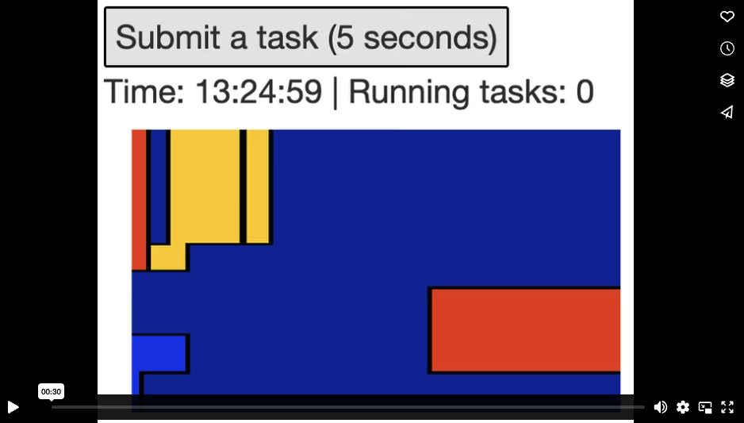

# About

`crew` is simple to use inside Shiny apps. Not only does `crew` bring parallel computing to a single app session, it elastically auto-scales worker processes to reduce the resource burden on other concurrent user sessions. And because of the [centralized controller interface](https://wlandau.github.io/crew/reference/crew_class_controller.html), there is no need to manually loop through individual tasks, which is convenient for workloads with thousands of tasks.

# Prerequisites

The example app requires `shiny >= 1.8.1.1`, `mirai >= 1.0.0`, and `nanonext >= 1.0.0`. Run the following in R to upgrade your versions of these packages.

```r
install.packages(c("shiny", "mirai", "nanonext"))
```

# Example: generative art

The simple example below has three interface elements: an action button, a plot output, and a text output. When you click the action button, a new 5-second task pushes to the `crew` controller. The action button can submit new tasks even when existing tasks are running in the background. The plot output shows the random visualization returned from latest task.

The text output continuously refreshes to show the current time and number of tasks in progress. Watch the short video linked below to see the app in action. You will see the time tick away even as tasks run in the background. In other words, the tasks run asynchronously and do not block the app session.

[](https://vimeo.com/927130003)

## Tutorial

To begin, the app script loads Shiny.

```r
library(shiny)
```

The `run_task()` function waits 5 seconds and then generates a random [`aRtsy::canvas_squares()`](https://koenderks.github.io/aRtsy/reference/canvas_squares.html) plot.

```r
run_task <- function() {
  Sys.sleep(5)
  aRtsy::canvas_squares(colors = aRtsy::colorPalette("random-palette"))
}
```

The [user interface](https://shiny.rstudio.com/articles/basics.html) shows the three parts explained previously, along with HTML/CSS formatting.

```r
ui <- fluidPage(
  tags$br(),
  tags$style("#status,#task{font-size:3em}"),
  tags$style("#task{border:3px solid black}"),
  actionButton("task", "Submit a task (5 seconds)"),
  textOutput("status"),
  plotOutput("result")
)
```

The [server](https://shiny.rstudio.com/articles/basics.html) sets up a [local process controller](https://wlandau.github.io/crew/reference/crew_controller_local.html). The controller has 4 workers, and each worker automatically shuts down if 10 seconds pass without any task assignments. `controller$autoscale()` uses a [`later`](https://r-lib.github.io/later/) loop to continuously launch workers to respond to the demand of tasks. The `onStop()` statement says to terminate the controller when the app session terminates.

```r
server <- function(input, output, session) {
  controller <- crew::crew_controller_local(workers = 4, seconds_idle = 10)
  controller$start()
  controller$autoscale()
  onStop(function() controller$terminate())
```

The `cue` object below is a [Shiny extended task](https://rstudio.github.io/shiny/reference/ExtendedTask.html) which accepts a [`mirai`](https://github.com/shikokuchuo/mirai) task object from `controller$push()`. Through the magic of Shiny, `promises`, and [`mirai`](https://github.com/shikokuchuo/mirai), this extended task can invalidate reactive expressions when a `crew` task completes.

```r
  cue <- ExtendedTask$new(func = identity)
```

The "Submit a task (5 seconds)" button pushes a new task to the controller and invokes the extended task.

```r
  observeEvent(
    input$task, 
    cue$invoke(controller$push(run_task(), data = list(run_task = run_task)))
  )
```

`cue$result()` triggers a plot update when a task completes, and we get the actual plot from `controller$pop()` to correctly remove the resolved task from the controller. `error = "stop"` relays any errors from the tasks.

```r
  output$result <- renderPlot({
    cue$result()
    controller$pop(error = "stop")$result[[1]]
  })
```

The text status periodically refreshes to show the current time and the number of tasks in progress. When you run the app, you will see the time tick away even as tasks and promises operate in the background.

```r
  output$status <- renderText({
    input$task
    cue$status()
    invalidateLater(millis = 1000)
    time <- format(Sys.time(), "%H:%M:%S")
    paste("Time:", time, "|", "Running tasks:", controller$unresolved())
  })
}
```

Finally, `shinyApp()` runs the app with the UI and server defined above.

```r
shinyApp(ui = ui, server = server)
```

## Code

See below for the complete `app.R` file.

```r
library(shiny)

run_task <- function() {
  Sys.sleep(5)
  aRtsy::canvas_squares(colors = aRtsy::colorPalette("random-palette"))
}

ui <- fluidPage(
  tags$br(),
  tags$style("#status,#task{font-size:3em}"),
  tags$style("#task{border:3px solid black}"),
  actionButton("task", "Submit a task (5 seconds)"),
  textOutput("status"),
  plotOutput("result")
)

server <- function(input, output, session) {
  # crew controller
  controller <- crew::crew_controller_local(workers = 4, seconds_idle = 10)
  controller$start()
  controller$autoscale()
  onStop(function() controller$terminate())

  # extended task to invalidate the plot
  cue <- ExtendedTask$new(func = identity)
  
  # button to submit a crew task
  observeEvent(
    input$task, 
    cue$invoke(controller$push(run_task(), data = list(run_task = run_task)))
  )
  
  # task result
  output$result <- renderPlot({
    cue$result()
    controller$pop(error = "stop")$result[[1]]
  })
  
  # time and task status
  output$status <- renderText({
    input$task
    cue$status()
    invalidateLater(millis = 1000)
    time <- format(Sys.time(), "%H:%M:%S")
    paste("Time:", time, "|", "Running tasks:", controller$unresolved())
  })
}

shinyApp(ui = ui, server = server)
```

# Example: coin flips

The example app below demonstrates a high-throughput scenario with thousands of tasks. The app has an action button and two text outputs. When you click the action button, the app submits a batch of 1000 tasks (simulated coin flips) to the `crew` controller. The action button can submit new tasks even when existing tasks are running in the background. The text outputs refresh to show the current time, the number of upcoming coin flips, and running totals for heads, tails, and errors.


## Tutorial

We first load Shiny.

```r
library(shiny)
```

Our task is a simulated coin flip: wait 0.1 seconds, then randomly return 1 for heads or 0 for tails. After many flips, the user may deduce that the coin is slightly unfair.

```r
flip_coin <- function() {
  Sys.sleep(0.1)
  rbinom(n = 1, size = 1, prob = 0.501)
}
```

The UI invites the user to simulate multiple coin flips and try to figure out if the coin is fair.

```r
ui <- fluidPage(
  div("Is the coin fair?"),
  actionButton("task", "Flip 1000 coins"),
  textOutput("status"),
  textOutput("outcomes")
)
```

In the server, we start by creating a `crew` controller which will simulate coin flips in parallel across 10 parallel workers.

```r
server <- function(input, output, session) {
  # crew controller
  controller <- crew::crew_controller_local(workers = 10, seconds_idle = 10)
  controller$start()
  controller$autoscale()
  onStop(function() controller$terminate())
```

We keep running totals of heads, tails, and task errors in a list of reactive values. 

```r
  flips <- reactiveValues(heads = 0, tails = 0)
```

As before, we create a [Shiny extended task](https://rstudio.github.io/shiny/reference/ExtendedTask.html) to invalidate reactive expressions when a task completes.

```r
  cue <- ExtendedTask$new(func = identity)
```

We create an action button to submit a batch of 1000 coin flips. Each coin flip is a separate `crew` task, and we invoke the [Shiny extended task](https://rstudio.github.io/shiny/reference/ExtendedTask.html) on each one.

```r
  observeEvent(input$task, {
    tasks <- controller$walk(
      command = flip_coin(),
      iterate = list(index = seq_len(1000)),
      data = list(flip_coin = flip_coin)
    )
    lapply(tasks, cue$invoke)
  })
```

A text output refreshes to show the current time and the number of coin flips submitted but not yet completed. The refresh happens when a batch of coin flips is submitted, a coin flip completes, or a full second has passed.

```r
  output$status <- renderText({
    input$task
    cue$status()
    invalidateLater(millis = 1000)
    time <- format(Sys.time(), "%H:%M:%S")
    sprintf("%s Flipping %s coins.", time, controller$unresolved())
  })
```

Another text output automatically refreshes to show the total number of heads, tails, and errors from completed coin flips.

```r
  output$outcomes <- renderText(
    sprintf("%s heads %s tails", flips$heads, flips$tails)
  )
```

We collect new coin flip results as they complete.

```r
  observe({
    cue$result()
    new_flip <- controller$pop(error = "stop")$result[[1]]
    req(new_flip)
    flips$heads <- flips$heads + new_flip
    flips$tails <- flips$tails + (1 - new_flip)
  })
}
```

Lastly, we run the app.

```r
shinyApp(ui = ui, server = server)
```

## Code

See below for the complete `app.R` file.

```r
library(shiny)

flip_coin <- function() {
  Sys.sleep(0.1)
  rbinom(n = 1, size = 1, prob = 0.501)
}

ui <- fluidPage(
  div("Is the coin fair?"),
  actionButton("task", "Flip 1000 coins"),
  textOutput("status"),
  textOutput("outcomes")
)

server <- function(input, output, session) {
  # crew controller
  controller <- crew::crew_controller_local(workers = 10, seconds_idle = 10)
  controller$start()
  controller$autoscale()
  onStop(function() controller$terminate())
  
  # Keep running totals of heads, tails, and task errors.
  flips <- reactiveValues(heads = 0, tails = 0)
  
  # Create an extended task to invalidate 
  cue <- ExtendedTask$new(func = identity)
  
  # Button to submit a batch of coin flips.
  observeEvent(input$task, {
    tasks <- controller$walk(
      command = flip_coin(),
      iterate = list(index = seq_len(1000)),
      data = list(flip_coin = flip_coin)
    )
    lapply(tasks, cue$invoke)
  })
  
  # Print time and task status.
  output$status <- renderText({
    input$task
    cue$status()
    invalidateLater(millis = 1000)
    time <- format(Sys.time(), "%H:%M:%S")
    sprintf("%s Flipping %s coins.", time, controller$unresolved())
  })

  # Print number of heads and tails.
  output$outcomes <- renderText(
    sprintf("%s heads %s tails", flips$heads, flips$tails)
  )
  
  # Observe new flips.
  observe({
    cue$result()
    new_flip <- controller$pop(error = "stop")$result[[1]]
    req(new_flip)
    flips$heads <- flips$heads + new_flip
    flips$tails <- flips$tails + (1 - new_flip)
  })
}

shinyApp(ui = ui, server = server)
```

# Coin flip alternative: `promises_all()`

The coin flip app spends a lot of effort churning through every single coin flip as soon as it completes. There are workarounds to reduce client-side overhead from thousands of flips. For example, you can use [`promises::promise_all()`](https://rstudio.github.io/promises/reference/promise_all.html) to trigger reactive expressions only when an entire batch of 1000 flips completes. The server only needs a slight modification:

```r
  cue <- ExtendedTask$new(func = promises::promise_all)
  
  # Button to submit a batch of coin flips.
  observeEvent(input$task, {
    tasks <- controller$walk(
      command = flip_coin(),
      iterate = list(index = seq_len(1000)),
      data = list(flip_coin = flip_coin)
    )
    do.call(cue$invoke, tasks)
  })
```

Full app:

```r
library(shiny)

flip_coin <- function() {
  Sys.sleep(0.1)
  rbinom(n = 1, size = 1, prob = 0.501)
}

ui <- fluidPage(
  div("Is the coin fair?"),
  actionButton("task", "Flip 1000 coins"),
  textOutput("status"),
  textOutput("outcomes")
)

server <- function(input, output, session) {
  # crew controller
  controller <- crew::crew_controller_local(workers = 10, seconds_idle = 10)
  controller$start()
  controller$autoscale()
  onStop(function() controller$terminate())
  
  # Keep running totals of heads, tails, and task errors.
  flips <- reactiveValues(heads = 0, tails = 0)
  
  # Create an extended task to invalidate 
  cue <- ExtendedTask$new(func = promises::promise_all)
  
  # Button to submit a batch of coin flips.
  observeEvent(input$task, {
    tasks <- controller$walk(
      command = flip_coin(),
      iterate = list(index = seq_len(1000)),
      data = list(flip_coin = flip_coin)
    )
    do.call(cue$invoke, tasks)
  })
  
  # Print time and task status.
  output$status <- renderText({
    input$task
    cue$status()
    invalidateLater(millis = 1000)
    time <- format(Sys.time(), "%H:%M:%S")
    sprintf("%s Flipping %s coins.", time, controller$unresolved())
  })

  # Print number of heads and tails.
  output$outcomes <- renderText(
    sprintf("%s heads %s tails", flips$heads, flips$tails)
  )
  
  # Observe new flips.
  observe({
    cue$result()
    new_flip <- controller$pop(error = "stop")$result[[1]]
    req(new_flip)
    flips$heads <- flips$heads + new_flip
    flips$tails <- flips$tails + (1 - new_flip)
  })
}

shinyApp(ui = ui, server = server)
```

# Coin flip alternative: polling

Alternatively, you rely entirely on `invalidateLater()` to poll the controller for tasks every second. The app is not as snappy, but it does reduce client-side overhead, and it does not rely on advanced features of Shiny or `promises`.

```r
library(shiny)

flip_coin <- function() {
  Sys.sleep(0.1)
  rbinom(n = 1, size = 1, prob = 0.501)
}

ui <- fluidPage(
  div("Is the coin fair?"),
  actionButton("task", "Flip 1000 coins"),
  textOutput("status"),
  textOutput("outcomes")
)

server <- function(input, output, session) {
  # crew controller
  controller <- crew::crew_controller_local(workers = 10, seconds_idle = 10)
  controller$start()
  onStop(function() controller$terminate())
  
  # Keep running totals of heads and tails.
  flips <- reactiveValues(heads = 0, tails = 0)
  
  # Button to submit a batch of coin flips.
  observeEvent(input$task, {
    controller$walk(
      command = flip_coin(),
      iterate = list(index = seq_len(1000)),
      data = list(flip_coin = flip_coin)
    )
  })
  
  # Print time and task status.
  output$status <- renderText({
    invalidateLater(millis = 1000)
    time <- format(Sys.time(), "%H:%M:%S")
    sprintf("%s Flipping %s coins.", time, controller$unresolved())
  })
  
  # Print number of heads and tails.
  output$outcomes <- renderText({
    pattern <- "%s heads %s tails"
    sprintf(pattern, flips$heads, flips$tails)
  })
  
  # Collect coin flip results.
  observe({
    invalidateLater(millis = 1000)
    results <- controller$collect(error = "stop")
    req(results)
    new_flips <- as.logical(results$result)
    flips$heads <- flips$heads + sum(new_flips)
    flips$tails <- flips$tails + sum(1 - new_flips)
  })
}

shinyApp(ui = ui, server = server)
```
