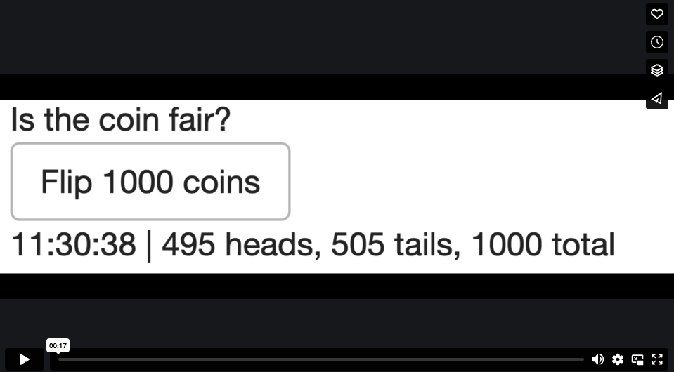

# About

`crew` is efficient to use in Shiny apps, and the [centralized controller](https://wlandau.github.io/crew/reference/crew_class_controller.html) makes the programming easy, even if there are thousands of tasks.

This vignette shows two versions of an example app. The first version is simple to code but choppily. The second version feels snappier because it uses integration between [`promises`](https://rstudio.github.io/promises/) and [`mirai`](https://github.com/shikokuchuo/mirai).

# Example: coin flips, no promises

This app simulates thousands of coin flips to determine if a coin is fair. Each coin flip is a task, and `crew` runs the tasks in parallel. When you run the app, the clock keeps ticking even while coin flips are running. In other words, parallel tasks run in the background and the app stays interactive.

[](https://vimeo.com/954101902)

## Tutorial

We first load Shiny.

```r
library(shiny)
```

The `flip_coin()` function simulates a coin flip: wait 0.1 seconds, then randomly return 1 for heads or 0 for tails. After many flips, the user may deduce that the coin is slightly unfair.

```r
flip_coin <- function() {
  Sys.sleep(0.1)
  rbinom(n = 1, size = 1, prob = 0.501)
}
```

The UI has a button to flip coins and a text output for results.

```r
ui <- fluidPage(
  div("Is the coin fair?"),
  actionButton("button", "Flip 1000 coins"),
  textOutput("results")
)
```

In the server, we start by creating a `crew` controller which will simulate coin flips in parallel across 10 parallel workers. `seconds_idle = 10` means each worker automatically exits if it idles for 10 seconds.

```r
server <- function(input, output, session) {
  controller <- crew::crew_controller_local(workers = 10, seconds_idle = 10)
  controller$start()
  onStop(function() controller$terminate())
```

We keep running totals of heads, tails, and total flips. 

```r
  flips <- reactiveValues(heads = 0, tails = 0, total = 0)
```

The action button submits a batch of 1000 coin flips.

```r
  observeEvent(input$button, {
    controller$walk(
      command = flip_coin(),
      iterate = list(index = seq_len(1000)),
      data = list(flip_coin = flip_coin)
    )
  })
```

We include an `observe()` statement to watch for finished coin flips and update the totals every 0.5 seconds.

```r
  observe({
    invalidateLater(millis = 500)
    results <- controller$collect(error = "stop")
    req(results)
    new_flips <- as.logical(results$result)
    flips$heads <- flips$heads + sum(new_flips)
    flips$tails <- flips$tails + sum(1 - new_flips)
    flips$total <- flips$total + length(new_flips)
  })
```

Finally, our text output refreshes every 0.5 seconds to update the clock and the totals.


A text output refreshes to show the current time and the number of coin flips submitted but not yet completed. The refresh happens when a batch of coin flips is submitted, a coin flip completes, or a full second has passed.

```r
  output$results <- renderText({
    invalidateLater(millis = 500)
    pattern <- "%s | %s heads, %s tails, %s total"
    time <- format(Sys.time(), "%H:%M:%S")
    sprintf(pattern, time, flips$heads, flips$tails, flips$total)
  })
}
```

## Full app code

```r
library(shiny)

flip_coin <- function() {
  Sys.sleep(0.1)
  rbinom(n = 1, size = 1, prob = 0.55)
}

ui <- fluidPage(
  div("Is the coin fair?"),
  actionButton("button", "Flip 1000 coins"),
  textOutput("results")
)

server <- function(input, output, session) {
  # crew controller
  controller <- crew::crew_controller_local(workers = 10, seconds_idle = 10)
  controller$start()
  onStop(function() controller$terminate())
  
  # Keep running totals of heads, tails, and total flips.
  flips <- reactiveValues(heads = 0, tails = 0, total = 0)
  
  # Flip a batch of coins when the button is pressed.
  observeEvent(input$button, {
    controller$walk(
      command = flip_coin(),
      iterate = list(index = seq_len(1000)),
      data = list(flip_coin = flip_coin)
    )
  })

  # Collect coin flip results.
  observe({
    invalidateLater(millis = 500)
    results <- controller$collect(error = "stop")
    req(results)
    new_flips <- as.logical(results$result)
    flips$heads <- flips$heads + sum(new_flips)
    flips$tails <- flips$tails + sum(1 - new_flips)
    flips$total <- flips$total + length(new_flips)
  })
  
  # Print time and flip counts.
  output$results <- renderText({
    invalidateLater(millis = 500)
    pattern <- "%s | %s heads, %s tails, %s total"
    time <- format(Sys.time(), "%H:%M:%S")
    sprintf(pattern, time, flips$heads, flips$tails, flips$total)
  })
}

shinyApp(ui = ui, server = server)
```

# Example: coin flips, with promises

The previous app feels choppy because it only refreshes every half second. Using the powerful integration between [`promises`](https://rstudio.github.io/promises/) and [`mirai`](https://github.com/shikokuchuo/mirai), we can make the UI respond as soon as a task finishes. Watch the video below to see the difference:

[](https://vimeo.com/954134172)

## Tutorial

The revised app has two changes. First, it takes `mirai` task returned by `controller$push()` and turns it into a special [`promise`](https://rstudio.github.io/promises/). This [`promise`](https://rstudio.github.io/promises/) updates the coin flip counts as soon as the flip finishes.

```r
observeEvent(
  input$button,
  replicate(
    1000,
    controller$push(flip_coin(), data = list(flip_coin = flip_coin)) %...>%
      collect_flips(controller, flips)
  )
)
```

The `collect_flips()` function collects all the finished flips and updates the flip counts.

```r
collect_flips <- function(ignore, controller, flips) {
  new_flips <- as.integer(controller$collect(error = "stop")$result)
  if (!length(new_flips)) return()
  flips$heads <- flips$heads + sum(new_flips)
  flips$tails <- flips$tails + sum(1 - new_flips)
  flips$total <- flips$total + length(new_flips)
}
```

## Full app code

```r
library(promises)
library(shiny)

flip_coin <- function() {
  Sys.sleep(0.1)
  rbinom(n = 1, size = 1, prob = 0.55)
}

collect_flips <- function(ignore, controller, flips) {
  new_flips <- as.integer(controller$collect(error = "stop")$result)
  if (!length(new_flips)) return()
  flips$heads <- flips$heads + sum(new_flips)
  flips$tails <- flips$tails + sum(1 - new_flips)
  flips$total <- flips$total + length(new_flips)
}

ui <- fluidPage(
  div("Is the coin fair?"),
  actionButton("button", "Flip 1000 coins"),
  textOutput("results")
)

server <- function(input, output, session) {
  # crew controller
  controller <- crew::crew_controller_local(workers = 10, seconds_idle = 10)
  controller$start()
  onStop(function() controller$terminate())
  
  # Keep running totals of heads, tails, and total flips.
  flips <- reactiveValues(heads = 0, tails = 0, total = 0)
  
  # Flip a batch of coins when the button is pressed.
  observeEvent(
    input$button,
    replicate(
      1000,
      controller$push(flip_coin(), data = list(flip_coin = flip_coin)) %...>%
        collect_flips(controller, flips)
    )
  )

  # Print time and flip counts.
  output$results <- renderText({
    invalidateLater(millis = 500)
    pattern <- "%s | %s heads, %s tails, %s total"
    time <- format(Sys.time(), "%H:%M:%S")
    sprintf(pattern, time, flips$heads, flips$tails, flips$total)
  })
}

shinyApp(ui = ui, server = server)
```
