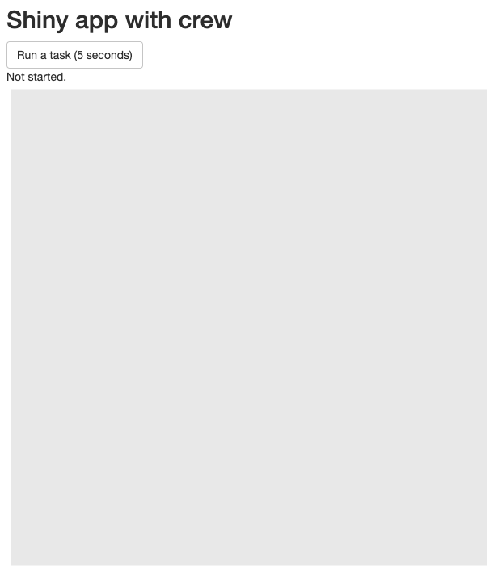
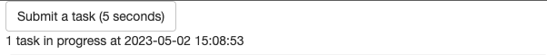
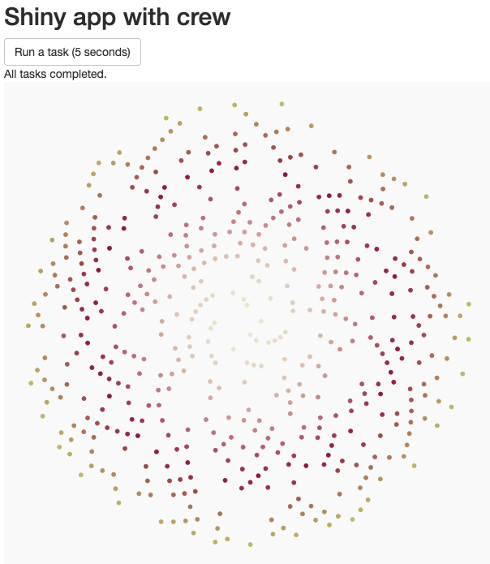
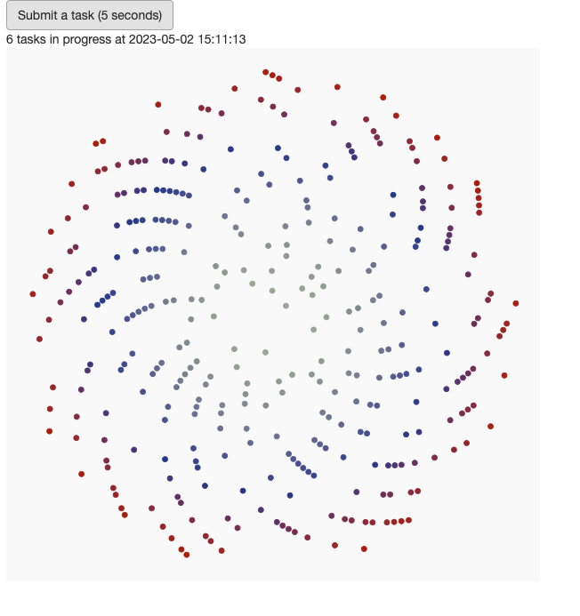
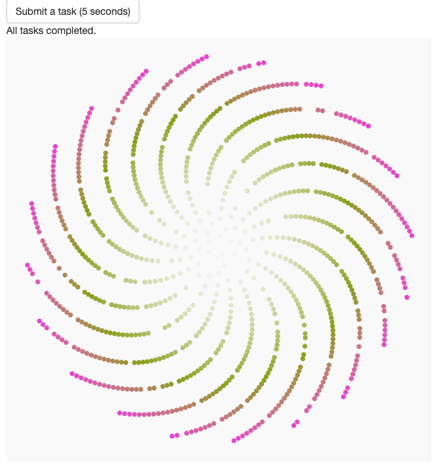

```{r, include = FALSE}
knitr::opts_chunk$set(
  collapse = TRUE,
  comment = "#>"
)
```

## About

Shiny has revolutionized interactive web apps in R. However, because of the staggering breadth of possibilities it created, the official ecosystem still has unmet needs. In particular, long-running tasks are challenging because they may block the R session and cause the app to lag. Any degree of latency is detrimental because web app users expect instant responses. Long tasks should run asynchronously to free up the main process for user interactions.

The [`promises`](https://rstudio.github.io/promises/) package is a popular solution for asynchronous programming in Shiny. With the help of [`future`](https://future.futureverse.org/), it keeps the main process free and responsive. However, as [its own documentation explains](https://rstudio.github.io/promises/articles/intro.html), the [`promises`](https://rstudio.github.io/promises/) package focuses on apps with only a small number of specific bottlenecks. By design, it does not scale to the prodigious quantities of heavy tasks that industrial enterprise-level apps aim to farm out in production-level pipelines.

By contrast, `crew` scales out easily, and it controller asynchronously manages all the tasks from a single convenient place. This vignette demonstrates scalable asynchronous programming with `crew` in Shiny.

## Example {.tabset}

### Open {.active}

Our example app opens like this:



### Submission

When you click the "Run a task (5 seconds)" button, `crew` runs a long task in the background. In this case, each task is an R function call that sleeps for 5 seconds and then produces a [`ggplot`](https://ggplot2.tidyverse.org/) of a low-resolution [phyllotaxis](https://en.wikipedia.org/wiki/Phyllotaxis) using the [`aRtsy`](https://koenderks.github.io/aRtsy/) package. The app continuously refreshes the current time and the number of tasks in progress.



### Completion

As soon as a task completes, the app retrieves the result from the `crew` workers and plots the output.



### Load

You can submit many more tasks than there are workers currently running. In the following screenshot, the app is only running 2 workers, but there are 13 tasks in the queue.



### End

Thanks to the efficient scheduling of [`mirai`](https://github.com/shikokuchuo/mirai) in the backend, `crew` workers successfully complete all 13 tasks. Because the app runs 2 workers, as many as 2 plots may show in quick succession.



## {-}

## Tutorial

Each plot in the app is a [`ggplot`](https://ggplot2.tidyverse.org/) of a low-resolution [phyllotaxis](https://en.wikipedia.org/wiki/Phyllotaxis) from the [`aRtsy`](https://koenderks.github.io/aRtsy/) package. [`canvas_phyllotaxis()`](https://koenderks.github.io/aRtsy/reference/canvas_phyllotaxis.html) is actually quite fast, so we make the task noticeably long with an artificial 5-second delay.^[Machine learning and Bayesian data analysis have plenty of examples of long-running tasks in data science and statistics.]

```r
library(crew)
library(shiny)
library(ggplot2)
library(aRtsy)

create_figure <- function() {
  Sys.sleep(5)
  canvas_phyllotaxis(
    colors = colorPalette(name = "random", n = 3),
    iterations = 1000,
    angle = runif(n = 1, min = 90, max = 270),
    size = runif(n = 1, min = 2, max = 3),
    p = runif(n = 1, min = 0, max = 1),
  )
}
```

Next, we have a function that accepts the number of tasks in progress and returns a text string with the status message.

```r
status_message <- function(number_tasks) {
  if (number_tasks == 0) {
    "All tasks completed."
  } else if (number_tasks == 1) {
    paste(number_tasks, "task in progress at", Sys.time())
  } else {
    paste(number_tasks, "tasks in progress at", Sys.time())
  }
}
```

The [user interface](https://shiny.rstudio.com/articles/basics.html) has a button to submit a task, a text output with the status, and a plot with the result of the most recently completed task.

```r
ui <- fluidPage(
  titlePanel("Shiny app with crew"),
  actionButton("task", "Run a task (5 seconds)"),
  textOutput("status"),
  plotOutput("figure")
)
```

The [server](https://shiny.rstudio.com/articles/basics.html) begins with reactive values and outputs for the [phyllotaxis](https://en.wikipedia.org/wiki/Phyllotaxis) figure and the status.

```r
server <- function(input, output, session) {
  figure <- reactiveVal(ggplot())
  status <- reactiveVal("Not started.")
  output$figure <- renderPlot(figure(), height = 600, width = 600)
  output$status <- renderText(status())
```

Next, we start a `crew` controller with up to 2 workers and an idle time of 10 seconds.

```r
  controller <- crew_controller_local(workers = 2, seconds_idle = 10)
  controller$start()
  onStop(function() controller$terminate())
```

Every time the user presses the "Run a task (5 seconds)" button, the app pushes a new task to the `crew` controller. If there are other tasks already running on the workers, the task may not actually start for several seconds.

```r
  observeEvent(input$task, {
    controller$push(
      command = create_figure(),
      data = list(create_figure = create_figure),
      packages = "aRtsy"
    )
  })
```

At the bottom of `server()` is the crux of the app: the event loop that watches for results. Below, `invalidateLater(millis = 250)` causes the code in `observe()` to rerun every 0.25 seconds.^[`controller$pop()` is inexpensive, especially when there are no workers to relaunch or results to collect. In practice, the polling interval is a balance between responsiveness and CPU usage, and it may not be 0.25 seconds for every app.] The code inside `if (isFALSE(controller$empty())) {` runs whenever there are any unfinished tasks or available results. `result <- controller$pop()$result` not only tries to collect the latest result, but also relaunches any workers that previously idled out but now need to run the backlog of tasks.

```r
  observe({
    invalidateLater(millis = 250)
    if (isFALSE(controller$empty())) {
      result <- controller$pop()$result
      if (!is.null(result)) {
        figure(result)
      }
      status(status_message(number_tasks = length(controller$queue)))
    }
  })
}
```

Finally, `shinyApp()` runs the app with the UI and server defined above.

```r
shinyApp(ui = ui, server = server)
```

## Code

The complete `app.R` file is below.

```r
library(crew)
library(shiny)
library(ggplot2)
library(aRtsy)

create_figure <- function() {
  Sys.sleep(5)
  canvas_phyllotaxis(
    colors = colorPalette(name = "random", n = 3),
    iterations = 1000,
    angle = runif(n = 1, min = 90, max = 270),
    size = runif(n = 1, min = 2, max = 3),
    p = runif(n = 1, min = 0, max = 1),
  )
}

status_message <- function(number_tasks) {
  if (number_tasks == 0) {
    "All tasks completed."
  } else if (number_tasks == 1) {
    paste(number_tasks, "task in progress at", Sys.time())
  } else {
    paste(number_tasks, "tasks in progress at", Sys.time())
  }
}

ui <- fluidPage(
  titlePanel("Shiny app with crew"),
  actionButton("task", "Run a task (5 seconds)"),
  textOutput("status"),
  plotOutput("figure")
)

server <- function(input, output, session) {
  # reactive values and outputs
  figure <- reactiveVal(ggplot())
  status <- reactiveVal("Not started.")
  output$figure <- renderPlot(figure(), height = 600, width = 600)
  output$status <- renderText(status())
  
  # crew controller
  controller <- crew_controller_local(workers = 2, seconds_idle = 10)
  controller$start()
  onStop(function() controller$terminate())
  
  # button to submit a task
  observeEvent(input$task, {
    controller$push(
      command = create_figure(),
      data = list(create_figure = create_figure),
      packages = "aRtsy"
    )
  })
  
  # event loop to collect finished tasks
  observe({
    invalidateLater(millis = 250)
    if (isFALSE(controller$empty())) {
      result <- controller$pop()$result
      if (!is.null(result)) {
        figure(result)
      }
      status(status_message(number_tasks = length(controller$queue)))
    }
  })
}

shinyApp(ui = ui, server = server)
```
