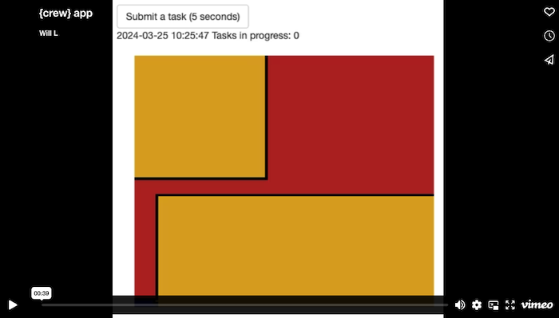

# About

`crew` is simple to use inside Shiny apps. Not only does `crew` bring parallel computing to a single app session, it elastically auto-scales worker processes to reduce the resource burden on other concurrent user sessions. And because of the [centralized controller interface](https://wlandau.github.io/crew/reference/crew_class_controller.html), there is no need to manually loop through individual tasks, which is convenient for workloads with thousands of tasks.

# Example

The simple example below has three interface elements: an action button, a plot output, and a text output. When you click the action button, a new 5-second task pushes to the `crew` controller. The plot output shows the random visualization returned from latest task.

The text output continuously refreshes to show the current time and number of tasks in progress. Watch a 39-second video to see the app in action. You will see the time tick away even as tasks run in the background. In other words, the tasks run asynchronously and do not block the app session.

[](https://vimeo.com/927130003)

# Prerequisites

The example app uses extended tasks, which are only available in Shiny 1.8.0.9000 or above. If your installed version of Shiny is too low, you can upgrade to the development version with:

```r
remotes::install_github("rstudio/shiny")
```

# Tutorial

To begin, the app script loads Shiny.

```r
library(shiny)
```

The `run_task()` function waits 5 seconds and then generates a random [`aRtsy::canvas_squares()`](https://koenderks.github.io/aRtsy/reference/canvas_squares.html) plot.

```r
run_task <- function() {
  Sys.sleep(5)
  aRtsy::canvas_squares(colors = aRtsy::colorPalette("random-palette"))
}
```

The [user interface](https://shiny.rstudio.com/articles/basics.html) shows the three parts explained previously.

```r
ui <- fluidPage(
  actionButton("task", "Submit a task (5 seconds)"),
  textOutput("status"),
  plotOutput("result")
)
```

The [server](https://shiny.rstudio.com/articles/basics.html) sets up a [local process controller](https://wlandau.github.io/crew/reference/crew_controller_local.html). The controller has 4 workers, and each worker automatically shuts down if 10 seconds pass without any task assignments. The `onStop()` statement says to terminate the controller when the app session terminates.

```r
server <- function(input, output, session) {
  controller <- crew::crew_controller_local(workers = 4, seconds_idle = 10)
  controller$start()
  onStop(function() controller$terminate())
```

The `task` object below is a Shiny extended task which accepts a promise object from the controller. The `crew` promise resolves when a task completes, and the `ExtendedTask` object efficiently manages a queue of such promises.^[For more on extended tasks, install the development version of Shiny and call `?shiny::ExtendedTask` to view the help file.]
^[For more on `crew` promises, visit <https://wlandau.github.io/crew/articles/promises.html>.]

```r
  task <- ExtendedTask$new(function() controller$promise(mode = "one"))
```

The "Submit a task (5 seconds)" button pushes a new task to the controller and enqueues a new promise to asynchronously handle the result.

```r
  observeEvent(input$task, {
    controller$push(command = run_task(), data = list(run_task = run_task))
    task$invoke()
  })
```

Because of the Shiny extended task and the `crew` promise, the plot output automatically refreshes almost immediately after the task completes. 

```r
  output$result <- renderPlot(task$result()$result[[1L]])
```

The text status periodically refreshes to show the current time and the number of tasks in progress. When you run the app, you will see the time tick away even as tasks and promises operate in the background.

```r
  output$status <- renderText({
    input$task
    task$status()
    invalidateLater(millis = 1000)
    paste(format(Sys.time()), "\nTasks in progress:", controller$unresolved())
  })
}
```

Finally, `shinyApp()` runs the app with the UI and server defined above.

```r
shinyApp(ui = ui, server = server)
```

# Code

See below for the complete `app.R` file.

```r
library(shiny)

run_task <- function() {
  Sys.sleep(5)
  aRtsy::canvas_squares(colors = aRtsy::colorPalette("random-palette"))
}

ui <- fluidPage(
  actionButton("task", "Submit a task (5 seconds)"),
  textOutput("status"),
  plotOutput("result")
)

server <- function(input, output, session) {
  # crew controller
  controller <- crew::crew_controller_local(workers = 4, seconds_idle = 10)
  controller$start()
  onStop(function() controller$terminate())

  # extended task to get completed results from the controller
  task <- ExtendedTask$new(function() controller$promise(mode = "one"))
  
  # button to submit a crew task
  observeEvent(input$task, {
    controller$push(command = run_task(), data = list(run_task = run_task))
    task$invoke()
  })
  
  # task result
  output$result <- renderPlot(task$result()$result[[1L]])
  
  # time and task status
  output$status <- renderText({
    input$task
    task$status()
    invalidateLater(millis = 1000)
    paste(format(Sys.time()), "\nTasks in progress:", controller$unresolved())
  })
}

shinyApp(ui = ui, server = server)
```
